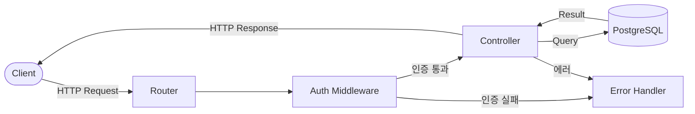
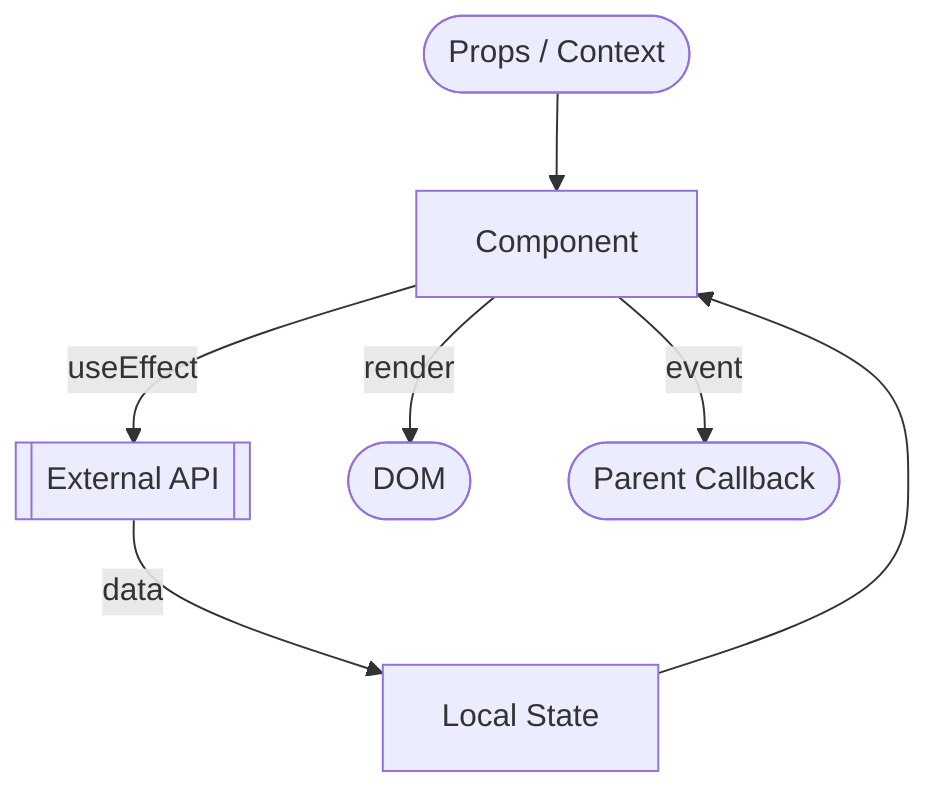
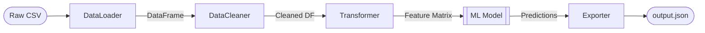
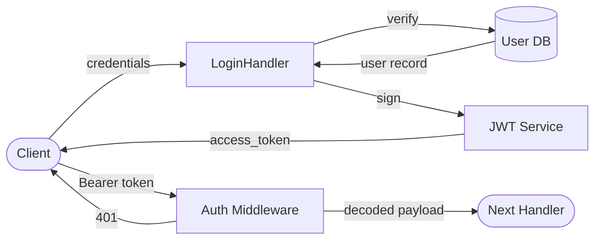

# Blueprint Framework — Master Document

> 이 문서는 Project Blueprint Framework의 전체 명세입니다.  
> 에이전트와 개발자 모두를 위한 **단일 진실 공급원(Single Source of Truth)** 입니다.

---

## 목차

1. [프레임워크 개요](#1-프레임워크-개요)
2. [폴더 README 구조 명세](#2-폴더-readme-구조-명세)
3. [DFD 작성 가이드](#3-dfd-작성-가이드)
4. [Progress Tracker 규칙](#4-progress-tracker-규칙)
5. [Agent Control 섹션 규칙](#5-agent-control-섹션-규칙)
6. [전체 적용 예시](#6-전체-적용-예시)

---

## 1. 프레임워크 개요

### 배경

AI 에이전트는 단일 파일 수준에서는 탁월한 성능을 보이지만,  
**프로젝트 전체 맥락**을 유지하면서 작업할 때 다음 문제가 발생합니다:

- 데이터 흐름을 오해해 의도치 않은 사이드 이펙트 발생
- 이미 구현된 기능을 중복 구현하거나 미구현 기능을 건너뜀
- 폴더별 아키텍처 원칙(Pure Function, 의존성 제한 등)을 무시

### 해결책

Blueprint Framework는 **각 폴더의 `README.md`를 에이전트의 컨텍스트 문서로 활용**합니다.  
에이전트가 작업 전 이 문서를 읽도록 강제함으로써 위 문제를 구조적으로 차단합니다.

---

## 2. 폴더 README 구조 명세

모든 폴더의 `README.md`는 아래 섹션을 순서대로 포함해야 합니다:

```
## [폴더명] Overview          # 이 폴더의 책임 범위 (1~3문장)
## DFD (Data Flow Diagram)   # mermaid 차트로 입출력 흐름 시각화
## Tech Stack                # 사용 기술/라이브러리 목록
## Agent Control             # 에이전트 행동 제약 규칙
## Progress Tracker          # 기능 구현 현황 테이블
## Next Roadmap              # 다음 작업 항목
```

각 섹션의 작성 규칙은 아래에서 설명합니다.

---

## 3. DFD 작성 가이드

### 목적

mermaid `flowchart` 또는 `sequenceDiagram`을 사용해 이 폴더가 처리하는  
**데이터의 진입점(Input) → 처리(Process) → 출력(Output)** 을 명시합니다.

에이전트는 이 다이어그램을 읽고, 자신이 수정할 코드가 이 흐름을 깨는지 검토해야 합니다.

### 작성 규칙

- `mermaid` 코드 블록 안에 작성
- 노드 이름은 영어, 화살표 레이블은 한/영 혼용 가능
- 외부 시스템(DB, API, 다른 모듈)은 `[[ ]]` 또는 `[(DB)]` 표기
- 변경 시 반드시 에이전트가 업데이트

### 예시 — REST API 서버의 `/api` 폴더



### 예시 — React 컴포넌트 폴더



### 예시 — Python 데이터 파이프라인



---

## 4. Progress Tracker 규칙

### 목적

`git log` 없이도 **무엇이 구현되었고, 무엇이 남았는지** 즉시 파악할 수 있게 합니다.

### 테이블 형식

```markdown
| Feature | Status | Assignee | Last Updated | Notes |
|---------|--------|----------|--------------|-------|
| 기능명  | ✅ Done / 🔄 In Progress / ⏳ Pending / ❌ Blocked | 담당자 또는 Agent | YYYY-MM-DD | 비고 |
```

### 상태 이모지 기준

| 이모지 | 상태 | 의미 |
|--------|------|------|
| ✅ | Done | 구현 완료 및 테스트 통과 |
| 🔄 | In Progress | 현재 작업 중 |
| ⏳ | Pending | 아직 시작 안 함 |
| ❌ | Blocked | 외부 의존성 또는 버그로 차단 |

### 에이전트 업데이트 의무

- 작업을 시작하면 해당 Feature의 상태를 `🔄 In Progress`로 변경
- 작업을 완료하면 `✅ Done`으로 변경하고 `Last Updated`를 오늘 날짜로 수정
- 새 기능을 추가하면 반드시 새 행을 삽입
- 블로커 발견 시 `❌ Blocked`로 변경하고 Notes에 이유 기재

---

## 5. Agent Control 섹션 규칙

### 목적

이 섹션은 에이전트에 대한 **폴더 수준의 System Prompt**입니다.  
에이전트는 이 섹션의 규칙을 코드 생성 전 반드시 읽고 준수해야 합니다.

### 작성 형식

```markdown
## Agent Control

> 이 섹션의 규칙은 에이전트가 이 폴더의 코드를 수정할 때 반드시 따라야 합니다.

### 허용 (Allow)
- ...

### 금지 (Prohibit)
- ...

### 필수 (Required)
- ...
```

### 예시 — 유틸리티 함수 폴더

```markdown
## Agent Control

### 허용
- 순수 함수(Pure Function) 작성
- TypeScript 내장 타입 사용
- 단위 테스트 파일 추가

### 금지
- 외부 npm 패키지 import 금지
- 전역 상태(global state) 참조 금지
- 비동기(async/await) 함수 금지

### 필수
- 모든 함수는 JSDoc 주석 포함
- 함수 하나당 단일 책임 원칙 준수
- 에러는 throw 대신 Result 타입으로 반환
```

### 예시 — API 라우터 폴더

```markdown
## Agent Control

### 허용
- Express Router 사용
- 기존 미들웨어 체인 활용

### 금지
- 라우터 파일 내 비즈니스 로직 직접 작성 금지 (Controller로 위임)
- DB 직접 쿼리 금지 (Service 레이어 경유 필수)

### 필수
- 새 엔드포인트 추가 시 DFD 업데이트
- 모든 라우트에 인증 미들웨어 적용
- HTTP 상태 코드는 RFC 7231 표준 준수
```

---

## 6. 전체 적용 예시

아래는 `src/auth/` 폴더의 완성된 `README.md` 예시입니다.

---

```markdown
# auth — Overview

사용자 인증 및 세션 관리를 담당합니다.  
JWT 발급/검증, OAuth 콜백 처리, 미들웨어 제공이 이 폴더의 책임입니다.

---

## DFD (Data Flow Diagram)



## Tech Stack

- Node.js 20 / Express 4
- jsonwebtoken 9.x
- bcrypt 5.x
- PostgreSQL (pg 8.x)

## Agent Control

### 금지
- JWT secret을 코드에 하드코딩 금지 (`process.env.JWT_SECRET` 사용)
- 비밀번호 평문 저장 금지
- 토큰 검증 로직을 미들웨어 외부에 분산 금지

### 필수
- 새 엔드포인트 추가 시 이 파일의 DFD 업데이트
- 인증 실패 시 에러 메시지에 구체적 사유 노출 금지 (보안)

## Progress Tracker

| Feature | Status | Assignee | Last Updated | Notes |
|---------|--------|----------|--------------|-------|
| JWT 발급 | ✅ Done | Agent | 2025-01-10 | RS256 알고리즘 |
| JWT 검증 미들웨어 | ✅ Done | Agent | 2025-01-10 | |
| Refresh Token | 🔄 In Progress | Agent | 2025-01-12 | Redis 연동 필요 |
| OAuth Google | ⏳ Pending | - | - | |
| 2FA (TOTP) | ⏳ Pending | - | - | |

## Next Roadmap

1. Refresh Token 엔드포인트 완성 (`POST /auth/refresh`)
2. Redis를 통한 토큰 블랙리스트 구현
3. Google OAuth 콜백 핸들러 추가
```
