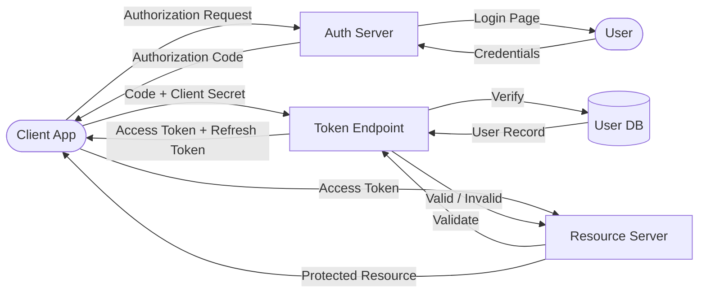

# OAuth2.0 — Overview

OAuth2.0 인증 서버 및 클라이언트 구현 프로젝트입니다.  
Authorization Code Flow, Token 발급/갱신/폐기, 외부 OAuth Provider 연동을 담당합니다.  
이 레포지토리는 [Blueprint Framework](./BLUEPRINT.md)를 따르며, 에이전트는 작업 전 반드시 이 문서를 읽어야 합니다.

---

## DFD (Data Flow Diagram)

---

## Tech Stack

- 미정 (구현 시 이 섹션을 업데이트할 것)

---

## Agent Control

> 이 섹션의 규칙은 에이전트가 이 레포지토리의 코드를 수정할 때 **반드시** 따라야 합니다.

### 허용 (Allow)

- 각 폴더의 `README.md` 작성 및 업데이트
- `templates/README_TEMPLATE.md` 기반 신규 폴더 README 생성
- Progress Tracker 상태 업데이트

### 금지 (Prohibit)

- 시크릿/키/토큰 값을 코드에 하드코딩 (반드시 환경변수 사용)
- `.env` 파일 또는 인증서 파일을 git에 커밋
- 폴더 README.md 미확인 상태에서 코드 수정 시작
- 테스트 없이 `✅ Done` 마킹

### 필수 (Required)

- 새 폴더 생성 시 `templates/README_TEMPLATE.md` 기반 README.md 생성
- 작업 시작 시 Progress Tracker를 `🔄 In Progress`로 변경
- 작업 완료 시 Progress Tracker를 `✅ Done` + 날짜로 업데이트
- 구조 변경 시 위 DFD 업데이트
- 커밋 메시지는 `CONTRIBUTING.md`의 규칙 준수

---

## Progress Tracker

| Feature | Status | Assignee | Last Updated | Notes |
|---------|--------|----------|--------------|-------|
| .gitignore 설정 | ✅ Done | Agent | 2026-05-18 | 시크릿/키/환경변수 파일 필터링 |
| 프로젝트 루트 README Blueprint 적용 | ✅ Done | Agent | 2026-05-18 | |
| 기술 스택 확정 | ⏳ Pending | - | - | |
| Authorization Server 구현 | ⏳ Pending | - | - | |
| Token Endpoint 구현 | ⏳ Pending | - | - | |
| Resource Server 미들웨어 구현 | ⏳ Pending | - | - | |
| 외부 OAuth Provider 연동 (Google 등) | ⏳ Pending | - | - | |
| Refresh Token 갱신/폐기 | ⏳ Pending | - | - | |

---

## Next Roadmap

1. 기술 스택 확정 (언어, 프레임워크, DB) 및 README Tech Stack 업데이트
2. 프로젝트 폴더 구조 설계 및 각 폴더 README.md 생성
3. Authorization Server 기본 구현 시작

---

> 에이전트 행동 규칙 전문: [CONTRIBUTING.md](./CONTRIBUTING.md)  
> 프레임워크 명세 전문: [BLUEPRINT.md](./BLUEPRINT.md)
