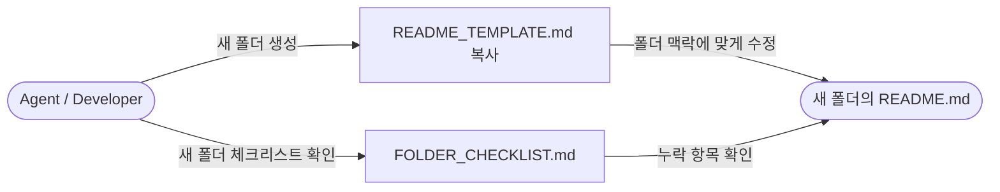

# templates — Overview

프로젝트 전반에서 사용하는 **문서 템플릿 파일**을 보관합니다.  
에이전트는 새 폴더 생성 시 이 폴더의 `README_TEMPLATE.md`를 기반으로 해당 폴더의 `README.md`를 생성해야 합니다.

---

## DFD (Data Flow Diagram)

---

## Tech Stack

- Markdown

---

## Agent Control

> 이 섹션의 규칙은 에이전트가 이 폴더의 파일을 수정할 때 **반드시** 따라야 합니다.

### 허용 (Allow)

- `README_TEMPLATE.md` 및 `FOLDER_CHECKLIST.md` 내용 개선

### 금지 (Prohibit)

- 이 폴더에 템플릿 이외의 파일 추가
- 템플릿 파일을 그대로 실제 문서로 사용 (반드시 복사 후 수정)

### 필수 (Required)

- 새 폴더 생성 시 반드시 `README_TEMPLATE.md`를 기반으로 해당 폴더의 `README.md` 생성
- 생성 후 `[[ ]]` 플레이스홀더를 모두 실제 내용으로 교체

---

## Progress Tracker

| Feature | Status | Assignee | Last Updated | Notes |
|---------|--------|----------|--------------|-------|
| README_TEMPLATE.md 작성 | ✅ Done | - | 2026-05-14 | 초기 템플릿 |
| FOLDER_CHECKLIST.md 작성 | ✅ Done | - | 2026-05-14 | 초기 체크리스트 |

---

## Next Roadmap

1. 프로젝트 구현 폴더 생성 시 이 템플릿을 기반으로 각 폴더 README.md 생성
