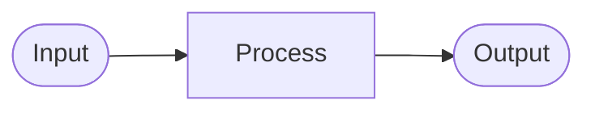

# [폴더명] — Overview

<!--
  이 파일을 작성하는 에이전트에게:
  1. 이 템플릿의 모든 [[ ]] 주석을 실제 내용으로 교체하세요.
  2. Overview 섹션을 1~3문장으로 간결하게 작성하세요.
  3. 이 파일을 작성한 후 CONTRIBUTING.md의 에이전트 행동 강령을 다시 확인하세요.
-->

이 폴더는 **[[ 이 폴더의 주요 책임을 1문장으로 ]]** 을 담당합니다.  
[[ 추가 맥락이 필요하면 여기에 작성. 필요 없으면 삭제. ]]

---

## DFD (Data Flow Diagram)

<!--
  데이터의 진입점(Input) → 처리(Process) → 출력(Output) 흐름을 mermaid로 시각화하세요.
  BLUEPRINT.md의 §3 DFD 작성 가이드를 참고하세요.
  구조 변경 시 반드시 이 섹션을 업데이트하세요.
-->

---

## Tech Stack

<!--
  이 폴더에서 사용하는 언어, 프레임워크, 라이브러리를 나열하세요.
  버전 정보를 포함하면 에이전트가 호환성 문제를 예방할 수 있습니다.
-->

- [[ 언어 / 런타임 버전 ]]
- [[ 프레임워크 및 버전 ]]
- [[ 주요 라이브러리 및 버전 ]]

---

## Agent Control

> 이 섹션의 규칙은 에이전트가 이 폴더의 코드를 수정할 때 **반드시** 따라야 합니다.

<!--
  BLUEPRINT.md의 §5 Agent Control 섹션 규칙을 참고해 작성하세요.
  이 폴더의 아키텍처 원칙에 맞게 구체적으로 기술할수록 효과가 높아집니다.
-->

### 허용 (Allow)

- [[ 허용되는 패턴, 라이브러리, 접근 방식 ]]

### 금지 (Prohibit)

- [[ 금지되는 패턴, 라이브러리, 접근 방식 ]]

### 필수 (Required)

- [[ 반드시 해야 하는 행동 (예: DFD 업데이트, 테스트 작성 등) ]]

---

## Progress Tracker

<!--
  에이전트는 작업 시작 시 🔄, 완료 시 ✅로 상태를 변경해야 합니다.
  새 기능 발견 시 새 행을 추가하세요.
  상태 이모지: ✅ Done | 🔄 In Progress | ⏳ Pending | ❌ Blocked
-->

| Feature | Status | Assignee | Last Updated | Notes |
|---------|--------|----------|--------------|-------|
| [[ 기능명 ]] | ⏳ Pending | - | - | |

---

## Next Roadmap

<!--
  에이전트는 작업 완료 후 이 섹션을 갱신해야 합니다.
  완료된 항목은 삭제하고, 새 항목을 우선순위 순으로 추가하세요.
-->

1. [[ 다음 작업 항목 1 ]]
2. [[ 다음 작업 항목 2 ]]
